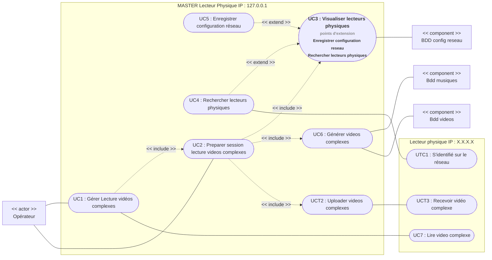
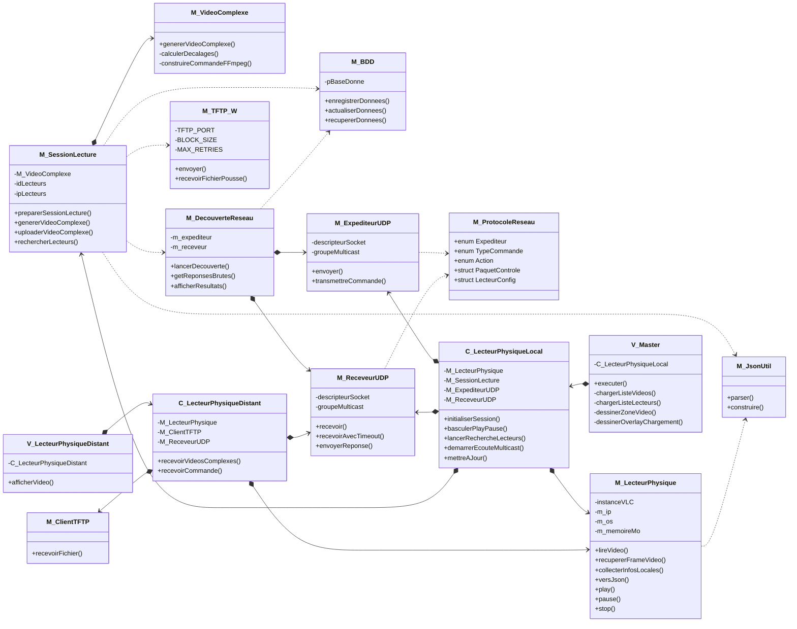

# AffichageSynchrone (Master)

## 📋 Présentation du Projet

Ce dépôt contient le code source de l'application **Master** développée dans le cadre du projet de BTS CIEL IR pour l'association *La Hora del Tango*. 

Le système complet permet de synchroniser l'affichage de vidéos de danse de tango filmées sous différents angles sur plusieurs écrans distants.

## 🏗️ Architecture du projet

### Diagramme de cas d'utilisation



### Diagramme de classes



Le projet respecte l'architecture **MVC (Modèle-Vue-Contrôleur)**.

## 🛠️ Technologies et dépendances

Développé en **C++23**, le programme utilise des threads et des variables atomiques pour gérer les calculs lourds sans jamais ralentir ou bloquer l'affichage de l'interface graphique.

* **Interface graphique (IHM) :** [Raylib](https://www.raylib.com/) & [Raygui](https://github.com/raysan5/raygui)
* **Moteur multimédia :** [LibVLC](https://www.videolan.org/vlc/libvlc.html)
* **Traitement du signal :** [FFTW3](https://www.fftw.org/)
* **Traitement vidéo et audio :** [FFmpeg](https://ffmpeg.org/)

## 📂 Structure du projet

```text
├── include/
│   ├── Controleur/
│   │   └── C_LecteurPhysiqueLocal.h
│   ├── Modele/
│   │   ├── M_DecouverteReseau.h
│   │   ├── M_ExpediteurUDP.h
│   │   ├── M_JsonUtil.h
│   │   ├── M_LecteurPhysique.h
│   │   ├── M_ProtocoleReseau.h
│   │   ├── M_ReceveurUDP.h
│   │   ├── M_SessionLecture.h
│   │   ├── M_TFTP_W.h
│   │   └── M_VideoComplexe.h
│   └── Vue/
│       └── V_Master.h
├── libs/
│   ├── FFTW
│   ├── JSON
│   ├── LibVLC
│   └── raygui
├── src/
│   ├── Controleur/
│   │   └── C_LecteurPhysiqueLocal.cpp
│   ├── Modele/
│   │   ├── M_DecouverteReseau.cpp
│   │   ├── M_ExpediteurUDP.cpp
│   │   ├── M_JsonUtil.cpp
│   │   ├── M_LecteurPhysique.cpp
│   │   ├── M_ReceveurUDP.cpp
│   │   ├── M_SessionLecture.cpp
│   │   ├── M_TFTP_W.cpp
│   │   └── M_VideoComplexe.cpp
│   └── Vue/
│       └── V_Master.cpp
├── main.cpp
└── CMakeLists.txt
```

## 🚀 Compilation & Installation

### Prérequis (Exemple sous Windows avec MinGW-w64)

Assurez-vous que les bibliothèques d'en-tête et les fichiers binaires (`.a` / `.lib` / `.dll`) de **Raylib**, **raygui**, **JSON**, **LibVLC** et **FFTW3** sont correctement installés sur votre système et référencés dans vos variables d'environnement ou le fichier `CMakeLists.txt`.

### Étapes de compilation

1. Créez un dossier de génération :

```bash
mkdir build && cd build
```

2. Générez les fichiers de configuration de build avec CMake :

```bash
cmake ..
```

3. Compilez le projet :

```bash
cmake --build . --config Release
```

> ⚠️ **Note importante :** Veillez à copier les DLL requises (`libvlc.dll`, `libvlccore.dll`, `libfftw3-3.dll`, etc.) ainsi que les exécutables FFmpeg (`ffmpeg.exe`) dans le répertoire de sortie de votre exécutable final pour assurer le bon fonctionnement du programme.

## 📊 Configuration de test

```cpp

const string IP_MULTICAST = "224.0.0.1";
constexpr int PORT_COMMANDES = 54321;
constexpr int PORT_DECOUVERTE = 5000;
constexpr int PORT_REPONSE = 5001;

// Liste statique préconfigurée pour le recettage initial
const vector<LecteurConfig> configurationReseau = {
    {0, "127.0.0.1", 2},       // Master local (ID 0)
    {1, "127.0.0.1", 2},       // Instance de test locale Slave (ID 1)
    {2, "172.31.71.104", 2}    // Lecteur physique distant cible (ID 2)
};

const string DOSSIER_VIDEOS = "videos";
const string CHEMIN_VIDEO_MASTER = "videosComplexes/VideoComplexe_0.mp4";

V_Master master(IP_MULTICAST, PORT_COMMANDES, PORT_DECOUVERTE, PORT_REPONSE, configurationReseau, DOSSIER_VIDEOS, CHEMIN_VIDEO_MASTER);

master.executer();

```

## 👥 Développeurs

* **Étudiant 1 :** Responsable de l'application **Master** (Interface graphique raygui, gestion des sessions, algorithme de corrélation croisée FFTW3/FFmpeg et intégration globale).

* **Étudiant 2 :** Responsable du protocole réseau, de la couche de communication UDP multicast et des transferts TFTP binaires.

* **Étudiant 3 :** Responsable du développement de l'application **Slave**.
